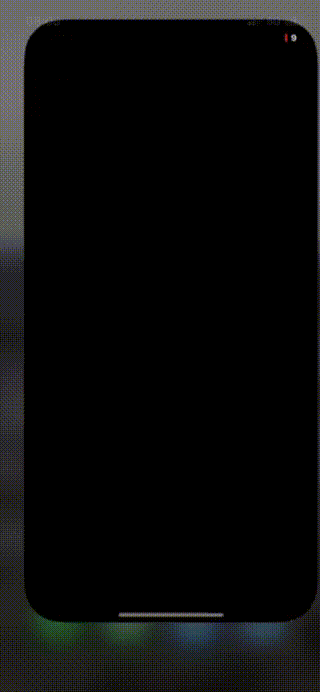

# NFCApp
This repository contains a sample iOS application. The app implements a simple iOS app that reads and writes sample NDEF data on an NFC tag. This is the base code used in following posts [Harnessing NFC Technology in your iOS App](https://javios.eu/swift/harnessing-nfc-technology-in-your-ios-app/) and  [iOS NFC Development: From URLs to Deeplinks](https://javios.eu/uncategorized/ios-nfc-development-from-urls-to-deeplinks/) 

## 🎥 Demo Video

### Check out the app in action!  
  
[Youtube](https://youtu.be/KQC92SKTqRg)

### Store a web link into NFC tag
  
[Youtube](https://youtu.be/T7no6VQmMas)

### Store an app deeplink into NFC tag

[Youtube](https://youtu.be/hs2WM2gIMGU)

## Requirements

- **Xcode 15.0 or later**
- **iOS 16.0 or later**
- **Swift 6.0**

